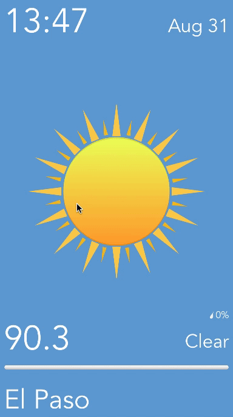

# SimplyWeather

I built this app and all its assets from the ground up.

Features: 
Long Press to refresh data 
Swipe left to change location 
Data autorefreshes when app is brought into foreground 

City Search Examples: 
"San Diego CA" 
"Rio De Jeneiro Brazil" 
"New York City" 

API Used: 
https://www.wunderground.com/weather/api 

Pods Used: 
SwiftyJson 
AlamoFire 
